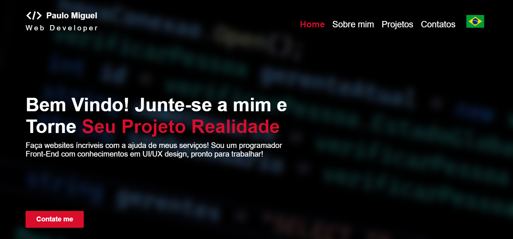

# Portifólio Desenvolvedor Front-End

## Inspiração para o Portifólio ✨
  ### Eu semprei gostei de coisas relacionadas ao cinema, então minha ideia era de fazer algo parecido e apresentar meus trabalhos com um design cinematográfico, então, procurei inspirações que relacionavam cinema e tecnologia, não precisei pensar muito para chegar nos streamings. A partir dessa ideia, meu portifolio tem design com cores voltadas ao vermelho e preto e com animações suaves. Assim como em uma plataforma de streaming, esse estilo transmite criatividade e profissionalismo, justamente a imagem que quero passar.

## Talvez você queira ver 💡
  ### [Currículo](https://docs.google.com/document/d/1xhimUtV6EM7c1GtwBwAHsIonX1HjoLSi/edit)

## Confira meus outros projetos 🛠️
  - [Barbershop - Plataforma de agendamento online](https://github.com/Paulo-Mikhael/barbershop?tab=readme-ov-file)
  - [Landing Page para uma plataforma de venda de ingressos](https://github.com/Paulo-Mikhael/cinema-lp?tab=readme-ov-file#readme)
  - [Blog API - API para blogs](http://github.com/Paulo-Mikhael/blog-api?tab=readme-ov-file)
  - [XWritter - Aplicação para compartilhar posts](https://github.com/Paulo-Mikhael/xwriter?tab=readme-ov-file#readme)

## Contatos
  
  
  
  
